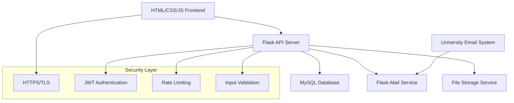

# Design Document

## Overview

The University Faculty Review System is designed as a modern, secure web application that enables anonymous faculty reviews for a single university while maintaining student privacy and providing faculty control over their participation. The system uses a three-tier architecture with an HTML/CSS/JavaScript frontend, Python Flask backend, and MySQL database, emphasizing security, anonymity, and user experience. The application is configured for a single university deployment, with university information stored in configuration rather than the database.

## Architecture

### High-Level Architecture



### Technology Stack

**Frontend:**
- HTML/CSS with modern CSS Grid and Flexbox
- Vanilla JavaScript or lightweight framework (Alpine.js)
- Bootstrap for responsive design and components
- Fetch API for backend communication

**Backend:**
- Python 3.8+ with Flask framework
- Flask-SQLAlchemy for database ORM
- Flask-JWT-Extended for JWT authentication
- Flask-Mail for email verification
- Flask-Limiter for rate limiting
- Flask-CORS for cross-origin resource sharing
- bcrypt (via werkzeug) for password hashing

**Database:**
- MySQL for reliable, ACID-compliant data storage
- SQLAlchemy for database migrations and management
- Connection pooling with SQLAlchemy engine

**Infrastructure:**
- HTTPS/TLS encryption for all communications
- Environment-based configuration with university settings
- Structured logging with winston
- Error monitoring and alerting

**Configuration:**
- University name, domain, and email domain stored in environment variables
- Single-university deployment model
- No multi-tenancy or university selection required

## Components and Interfaces

### Frontend Components

#### Core Components
1. **App Component**
   - Main application wrapper
   - Handles global state and routing
   - Manages authentication state

2. **Authentication Components**
   - `EmailVerification`: University email verification form
   - `VerificationSuccess`: Confirmation page after email verification

3. **Faculty Search Components**
   - `FacultySearch`: Search interface with filters
   - `FacultyCard`: Individual faculty profile card display
   - `FacultyProfile`: Detailed faculty profile with reviews

4. **Review Components**
   - `ReviewForm`: Anonymous review submission form
   - `ReviewDisplay`: Individual review display component
   - `RatingDisplay`: Star rating visualization component

5. **Faculty Dashboard Components**
   - `FacultyDashboard`: Faculty member's personal dashboard
   - `ProfileRemovalRequest`: Form for requesting profile removal

#### Component Interfaces

```typescript
interface FacultyProfile {
  id: string;
  name: string;
  department: string;
  profilePhoto?: string;
  overallRating: number;
  totalReviews: number;
}

interface Review {
  id: string;
  facultyId: string;
  rating: number;
  comment: string;
  createdAt: Date;
  categories: {
    teaching: number;
    communication: number;
    availability: number;
    organization: number;
  };
}

interface ReviewSubmission {
  facultyId: string;
  rating: number;
  comment: string;
  categories: {
    teaching: number;
    communication: number;
    availability: number;
    organization: number;
  };
}
```

### Backend API Endpoints

#### Authentication Endpoints
- `POST /api/auth/verify-email` - Send verification email to university address
- `POST /api/auth/confirm-verification` - Confirm email verification with token
- `POST /api/auth/faculty-login` - Faculty member authentication

#### Faculty Endpoints
- `GET /api/faculty/search` - Search faculty members with filters
- `GET /api/faculty/:id` - Get specific faculty profile and reviews
- `GET /api/faculty/:id/reviews` - Get paginated reviews for faculty
- `POST /api/faculty/removal-request` - Submit profile removal request

#### Review Endpoints
- `POST /api/reviews` - Submit anonymous review
- `GET /api/reviews/check-duplicate` - Check if user already reviewed faculty

#### Admin Endpoints (Developer Only)
- `GET /api/admin/removal-requests` - Get pending profile removal requests
- `POST /api/admin/process-removal` - Process profile removal request

## Data Models

### Database Schema

```sql
-- Faculty table
CREATE TABLE faculty (
    id CHAR(36) PRIMARY KEY DEFAULT (UUID()),
    name VARCHAR(255) NOT NULL,
    department VARCHAR(255) NOT NULL,
    profile_photo_url TEXT,
    overall_rating DECIMAL(2,1) DEFAULT 0.0,
    total_reviews INTEGER DEFAULT 0,
    is_active BOOLEAN DEFAULT true,
    created_at TIMESTAMP DEFAULT CURRENT_TIMESTAMP,
    updated_at TIMESTAMP DEFAULT CURRENT_TIMESTAMP ON UPDATE CURRENT_TIMESTAMP
);

-- Anonymous user tracking (for duplicate prevention)
CREATE TABLE anonymous_users (
    id CHAR(36) PRIMARY KEY DEFAULT (UUID()),
    email_hash VARCHAR(255) NOT NULL UNIQUE,
    created_at TIMESTAMP DEFAULT CURRENT_TIMESTAMP
);

-- Reviews table
CREATE TABLE reviews (
    id CHAR(36) PRIMARY KEY DEFAULT (UUID()),
    faculty_id CHAR(36),
    anonymous_user_id CHAR(36),
    overall_rating INTEGER CHECK (overall_rating >= 0 AND overall_rating <= 5),
    teaching_rating INTEGER CHECK (teaching_rating >= 0 AND teaching_rating <= 5),
    communication_rating INTEGER CHECK (communication_rating >= 0 AND communication_rating <= 5),
    availability_rating INTEGER CHECK (availability_rating >= 0 AND availability_rating <= 5),
    attendance_rating INTEGER CHECK (attendance_rating >= 0 AND attendance_rating <= 5),
    exam_rating INTEGER CHECK (exam_rating >= 0 AND exam_rating <=5),
    comment TEXT,
    created_at TIMESTAMP DEFAULT CURRENT_TIMESTAMP,
    FOREIGN KEY (faculty_id) REFERENCES faculty(id),
    FOREIGN KEY (anonymous_user_id) REFERENCES anonymous_users(id),
    UNIQUE(faculty_id, anonymous_user_id)
);

-- Profile removal requests
CREATE TABLE removal_requests (
    id CHAR(36) PRIMARY KEY DEFAULT (UUID()),
    faculty_id CHAR(36),
    contact_email VARCHAR(255) NOT NULL,
    reason TEXT,
    status VARCHAR(20) DEFAULT 'pending',
    created_at TIMESTAMP DEFAULT CURRENT_TIMESTAMP,
    processed_at TIMESTAMP NULL,
    FOREIGN KEY (faculty_id) REFERENCES faculty(id)
);

-- Email verification tokens
CREATE TABLE verification_tokens (
    id CHAR(36) PRIMARY KEY DEFAULT (UUID()),
    email_hash VARCHAR(255) NOT NULL,
    token VARCHAR(255) NOT NULL UNIQUE,
    expires_at TIMESTAMP NOT NULL,
    used BOOLEAN DEFAULT false,
    created_at TIMESTAMP DEFAULT CURRENT_TIMESTAMP
);
```

### Configuration-Based University Settings

Instead of storing university information in the database, the application uses environment-based configuration:

```python
# Configuration settings for single university deployment
class Config:
    # University configuration
    UNIVERSITY_NAME = os.environ.get('UNIVERSITY_NAME') or 'VIT-AP University'
    UNIVERSITY_DOMAIN = os.environ.get('UNIVERSITY_DOMAIN') or 'vitap.ac.in'
    UNIVERSITY_EMAIL_DOMAIN = os.environ.get('UNIVERSITY_EMAIL_DOMAIN') or '@vitapstudent.ac.in'
    
    # Email validation will check against UNIVERSITY_EMAIL_DOMAIN
    # All faculty and students belong to the same institution
```

### Anonymity Protection Strategy

1. **Email Hashing**: University emails are hashed using bcrypt before storage
2. **No Direct Linking**: Reviews are linked to anonymous_user_id, not actual email
3. **Token Expiration**: Verification tokens expire after 24 hours
4. **Duplicate Prevention**: Hash-based duplicate review prevention without identity exposure

## Error Handling

### Frontend Error Handling
- Global JavaScript error handling for uncaught exceptions
- Fetch API error handling with user-friendly messages
- Form validation with real-time feedback using JavaScript
- Network error handling with retry mechanisms

### Backend Error Handling
- Flask error handlers for different HTTP status codes
- Python logging module for structured error logging
- Flask-WTF for form validation with detailed error messages
- SQLAlchemy error handling with appropriate HTTP status codes

### Error Response Format
```python
# Python dictionary format for JSON responses
{
    "error": {
        "code": "string",
        "message": "string", 
        "details": {},  # optional
        "correlation_id": "string"
    }
}
```

## Testing Strategy

### Frontend Testing
- **Unit Tests**: JavaScript testing with simple test functions
- **Integration Tests**: Testing user flows and API integration with fetch
- **E2E Tests**: Manual testing of critical user journeys
- **Accessibility Tests**: Manual accessibility testing and validation

### Backend Testing
- **Unit Tests**: Python unittest or pytest for individual function testing
- **Integration Tests**: Flask test client for API endpoint testing
- **Database Tests**: Test database with SQLAlchemy and rollbacks
- **Security Tests**: Authentication and authorization testing with Flask-Testing

### Test Coverage Goals
- Minimum 80% code coverage for critical paths
- 100% coverage for security-related functions
- All API endpoints must have integration tests
- All user-facing components must have accessibility tests

### Testing Data Management
- Separate test database with automated cleanup
- Factory pattern for test data generation
- Mock external services (email verification)
- Anonymized test data that mirrors production patterns

## Security Considerations

### Data Protection
- All sensitive data encrypted at rest
- HTTPS enforced for all communications
- Regular security audits and dependency updates
- GDPR-compliant data handling procedures

### Authentication Security
- JWT tokens with short expiration times
- Secure token storage in httpOnly cookies
- Rate limiting on authentication endpoints
- Email verification with time-limited tokens

### Anonymity Guarantees
- No storage of plaintext email addresses
- Cryptographic hashing for duplicate prevention
- Regular purging of verification tokens
- Audit logging without personal information

### Input Validation
- Server-side validation for all inputs
- SQL injection prevention with parameterized queries
- XSS prevention with input sanitization
- File upload restrictions and validation